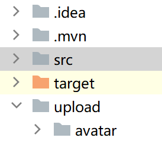
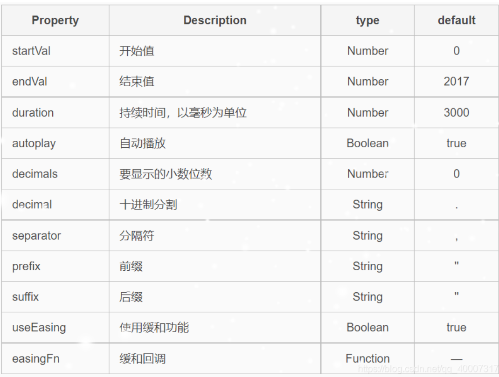
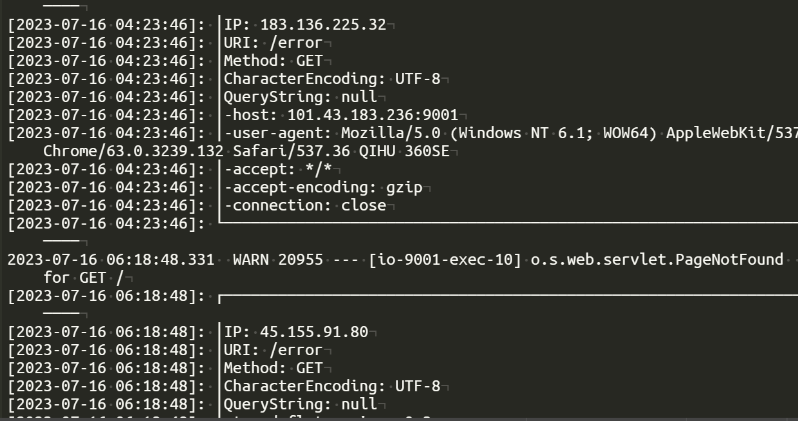

#### node.js创建数据库连接池

新建一个mydb.js用来创建连接池

```js
const mysql = require("mysql");

const pool = mysql.createPool({
    host: "localhost", // 主机地址
    port: 3306,
    database: "questions", // 数据库名字
    user: "root", // 连接数据库的用户名
    password: "123456", // 连接数据库密码
    connectionLimit: 20, // 连接池最大连接数
    multipleStatements: true // 允许执行多条sql语句
})

module.exports = pool;
```

然后在node文件中引用

```js
const pool = require("./mydb");          //导入连接池

app.post("/add", (req, res)=>{
    req.setEncoding("utf-8")
    res.writeHead(200,{'Content-Type':'text/html;charset=utf-8'});
    let text = req.body.question;
    let posedTime = req.body.posedTime;
    let insertSql = "insert into questions(title, posedTime) values(?, ?)";
    let insertParams = [text, posedTime];
    pool.getConnection((err, conn)=>{
        if(err){
            console.log("数据库连接失败");
            res.json({
                code: "501",
                msg: "后端数据库连接失败"
            });
        }else{
            conn.query(insertSql, insertParams, (err, result)=>{
                if(err){
                    res.json({
                        code: "201",
                        msg: "添加失败"
                    });
                    console.log('[INSERT ERROR] - ',err.message);
                }else{
                    res.json({
                        code: "200",
                        msg: "添加成功",
                        insertId: result
                    });
                    conn.release();         //释放连接
                }
            })
        }
    })
})
```

#### vue3中使用插槽

vue3中已经废弃了vue2时的slot-scope写法，取而代之的是*#title*写法，其中#相当于slot，title是自定义名称

*vue2*

```vue
<template slot="title" slot-scope="scope"></template>
```

*vue3*

```vue
<template #title="scope"></template>
```

#### 关于报错“ResizeObserver loop limit exceeded ”

在main.js中添加如下代码

```js
const debounce = (fn, delay) => {
    let timer = null;
    return function () {
        let context = this;
        let args = arguments;
        clearTimeout(timer);
        timer = setTimeout(function () {
            fn.apply(context, args);
        }, delay);
    }
}

const _ResizeObserver = window.ResizeObserver;
window.ResizeObserver = class ResizeObserver extends _ResizeObserver {
    constructor(callback) {
        callback = debounce(callback, 16);
        super(callback);
    }
}  
```

#### 将自定义属性和方法挂载到vue全局使用

首先在src下新建一个utils目录，然后新建index.js，该文件存放全局工具方法

```js
export const utils = {
    //获取当前日期，格式YYYY-MM-DD
    getNowFormatDay(nowDate) {
        var char = "-";
        if (nowDate == null) {
            nowDate = new Date();
        }
        var day = nowDate.getDate();
        var month = nowDate.getMonth() + 1;//注意月份需要+1
        var year = nowDate.getFullYear();
        //补全0，并拼接
        return year + char + this.completeDate(month) + char + this.completeDate(day);
    },
    //补全0
    completeDate(value) {
        return value < 10 ? "0" + value : value;
    },
    //获取当前时间，格式YYYY-MM-DD HH:mm:ss
    getNowFormatTime() {
        var nowDate = new Date();
        var colon = ":";
        var h = nowDate.getHours();
        var m = nowDate.getMinutes();
        var s = nowDate.getSeconds();
        //补全0，并拼接
        return this.getNowFormatDay(nowDate) + " " + this.completeDate(h) + colon + this.completeDate(m) + colon + this.completeDate(s);
    },
}
```

这里放的是获取当前时间的方法

然后在main.js中注册到全局

```js
import { utils } from '@/utils/index.js'     //导入自定义工具方法，注意使用{}，不然会有warning

app.config.globalProperties.$utils = utils;
```

然后就可以愉快的在组件中通过 *this.$utils* 来调用方法了

#### 关于vue3的setup

setup是vue3提供的一种组合式api，由于vue3向下兼容vue2，所以在使用时可以和vue2的选项式api，如下

```js
export default {
    name: "exers",
    setup(){
        const route = useRoute();
        onMounted(()=>{
            console.log(route.query.name);
        })
    },
    data(){
        return {}
    },
    methods: {
        ...
    }
}
```

为什么要使用setup？在选项式api中，对于一个data中的值会涉及到多个部分，这样会导致处理分散，因此可以将对于一个值的处理放到setup中，这样即便项目规模扩大，也可以很快地定位到该数据项

*vue2*

```vye
data(){
    return {
        num: 10
    }
},
methods: {
	add(){
		this.num++;
	},
	minus(){
		this.num--;
	}
},
```

*vue3*

```vue
import { ref } from 'vue';

export default {
    name: "exers",
    setup(){
        const num = ref(1);
        return {
            num,
            add(){
                num.value++;
            },
            minus(){
                num.value--;
            }
        }
    }
}
```

其中，ref 是让基础数据类型具备响应式的，因为在setup中不能通过this来访问，通过ref来定义的数据默认具有value属性

这里ref中的值表示num的初始值，即为1

setup中的数据和方法必须通过return来暴露给模板或其他地方使用

setup内部的属性都不是响应式的

setup会在created之前执行

#### 说明

由于项目的扩展，所以决定后端使用springboot

#### springboot基本依赖配置

- spring-boot-starter-web
- spring-boot-devtools
- lombok
- mysql-connector-java（数据库驱动）
- mybatis-plus-generator（mybatis-plus代码自动生成）
- spring-boot-starter-swagger
- freemarker（模板引擎）

#### springboot项目基本流程

- 配置基本依赖
- 建立entity、mapper、service（impl）、controller、common包
- 在common中新建 *CodeGenerator.java* 用于生成mybatis-plus代码（一定要修改生成的文件路径和数据库配置）
- 在resources文件夹下新建mapper文件夹用于存放xml文件
- 建立数据库和设计数据表
- 根据数据表建立对应的entity文件，设计controller

#### springboot配置数据库连接

在application.properties中加入以下代码

```properties
spring.datasource.driver-class-name=com.mysql.cj.jdbc.Driver      # mysql8以上的版本需要加cj

spring.datasource.url=jdbc:mysql://localhost:3306/questions?serverTimezone=Shanghai&?useUnicode=true&characterEncoding=utf8

spring.datasource.username=root

spring.datasource.password=123456
```

在properties文件中可能会出现乱码问题，原因是properties在idea中默认为utf-8编码，而properties使用的时ascii编码，按照以下方式进行转换


#### iPage.getTotal()值为0的问题

在config包中添加mybatis-plus的拦截器类，如下

```java
import com.baomidou.mybatisplus.annotation.DbType;
import com.baomidou.mybatisplus.extension.plugins.MybatisPlusInterceptor;
import com.baomidou.mybatisplus.extension.plugins.inner.PaginationInnerInterceptor;
import org.springframework.context.annotation.Bean;
import org.springframework.context.annotation.Configuration;

@Configuration
public class MybatisPlusConfig {
    @Bean
    public MybatisPlusInterceptor mybatisPlusInterceptor() {
        MybatisPlusInterceptor interceptor = new MybatisPlusInterceptor();
        interceptor.addInnerInterceptor(new PaginationInnerInterceptor(DbType.MYSQL));
        return interceptor;
    }
}

```

#### 单选按钮组的过渡动画以及取值

```vue
<el-collapse-transition>
    <div v-if="select">
        <el-radio-group v-model="value" @change="switchChange">
            <el-radio label="0" size="large" border>全部</el-radio>
            <el-radio label="1" size="large" border>已回答</el-radio>
            <el-radio label="2" size="large" border>未回答</el-radio>
        </el-radio-group>
    </div>
</el-collapse-transition>
```

在单选按钮组中，change事件添加在e-radio-group上，由于是双向绑定，所以value的初始值就是单选按钮的默认值，然后通过switchChange方法就可以获取到当前的value

#### vue3设置表单form中label的位置

在el-form组件中通过属性**labelPosition**设置，可取值：right、left、top

```vue
<el-form :rules="loginRules" ref="loginForm" :model="loginForm" labelPosition="top">
</el-form>
```

#### 关于账号和用户名的区别

账号一般由数字和字母组成，不可更改，不可重复

用户名是账号的另一种称谓，为了用户更方便的记住账号，可以重复

简单来说，账号是用户登录系统的凭证，而用户名是用户在系统中的名称

#### 访问springboot静态资源（图片）

这里将用户上传的数据单独放在一个目录下，以和项目代码区分开



这里upload目录存放用户上传的信息，avatar存放用户头像，文件名由**用户名_时间.jpg**组成

在application.properties文件中进行以下配置

```properties
spring.mvc.static-path-pattern=/upload/**
spring.web.resources.static-locations=classpath:/static,classpath:/css,classpath:/js, file:upload
```

第一个选项表示匹配以/upload开头的路径，第二个选项中的**file:upload**表示文件映射

这样在数据表中就可以通过存储**/upload/avatar/xxx.jpg**来表示用户的头像路径，然后拼接上前面的域名(或者IP地址)即可

#### mybatis-plus更新指定字段

```java
List<User> list = userService.lambdaQuery()
                .eq(User::getAccount, account)
                .eq(User::getPassword, password)
                .list();
User user = list.get(0);
UpdateWrapper<User> updateWrapper = new UpdateWrapper<>();
updateWrapper.eq("uid", user.getUid());
updateWrapper.set("login_time", loginTime);
userService.update(updateWrapper);
```

#### vue3中使用el-menu-item点击不跳转问题

在**el-menu** 中添加router

```vue
<el-menu active-text-color="#ffd04b" background-color="#545c64" class="el-menu-vertical-demo" default-active="/workbench" text-color="#fff" router>
    <el-menu-item index="/workbench">
        <template #title>
			<el-icon><Menu /></el-icon>
			工作台
        </template>
    </el-menu-item>
</el-menu>
```

注意，这里index中写的路径还需要在router/index.js中进行配置，这里的/workbench是/home的子路由

#### vue项目页面四周有空隙

在index.html中添加以下代码

```css
<style>
body{
    margin: 0;
}
</style>

```

#### 如何拿到mapState中的数据并在methods中使用

在computed下我引入了vuex中的全部数据

```js
computed: {
    ...mapState({
        account: "account",
        userx: "user",
        avatarx: "avatarUrl"
    })
},
```

然后在methods中通过 **this.account、this.userx** 就可以使用

以上写法等价于

```js
computed: {
    ...mapState(["account","user","avatarUrl"])
},
```

#### 关于使用el-upload实现上传头像的前后端代码

el-upload的官方文档：[Upload 上传 | Element Plus (element-plus.org)](https://element-plus.org/zh-CN/component/upload.html#属性)

##### 前端相关代码

```vue
<el-upload 
           ref="upload" class="avatar-uploader" 
           :before-upload="beforeAvatarUpload" 
           action="#"
           :http-request="uploadFile" 
           :auto-upload="false" 
           multiple
           list-type="picture-card" 
           :file-list="fileList"
           :on-change="fileChange">
    <el-icon>
        <Plus />
    </el-icon>
    <template #file="{ file }">
		
    </template>
</el-upload>
```

你可以看到el-upload具有很多属性，其中最常用的有如下几个

- action

  图片上传的url路径，但是一般不使用它，因为会存在跨域问题，你可以写上任意的字符，如“#”，我们会使用自定义的上传方法

- before-upload

​		在图片上传之前执行的钩子函数，一般用于检查文件的格式和大小是否满足条件

```js
beforeAvatarUpload(file) {
    //上传文件的格式
    const idJPG = (file.type === 'image/jpeg') || (file.type === 'image/png');
    //上传文件的大小
    const isLt2M = (file.size / 1024 / 1024) < 2;
    if (!idJPG) {
        this.$message.error("上传的图片只能是jpg或png格式");
        return false;
    }
    if (!isLt2M) {
        this.$message.error("上传的图片大小不能超过2MB");
        return false;
    }
    console.log("检查通过");
    return true;
}
```

它接收的参数file就是上传的文件

- http-request

​		自定义的上传方法，会覆盖默认的xhr上传行为，一般需要设置 **auto-upload="false"**，即关闭自动上传

```js
uploadFile(params) {
    const file = params.file;
    var forms = new FormData();
    forms.append("file", file);
    forms.append("updatedTime", this.$utils.getNowFormatTime());
    forms.append("uid", this.user.uid);
    this.$axios({
        method: "post",
        url: "/user/upload",
        data: forms,
    }).then(res => {
        if (res.data.code == "200") {
            this.$message({
                message: '上传成功',
                type: 'success'
            })
            this.avatarDialogVisible = false;
            this.avatarUrl = this.serverDomain + res.data.data;        //后端返回图像的地址
            let avatar = sessionStorage.getItem(this.account + "avatar");
            if (!avatar) {
                sessionStorage.setItem(this.account + "avatar", this.avatarUrl);
            }
        } else {
            this.$message({
                message: '上传失败',
                type: 'error'
            })
        }
    }).catch(err => {
        console.log("上传文件时发生错误: " + err);
    })
}
```

- multiple

​		是否支持多选文件

- list-type

​		文件列表的类型，可选择的值有：text、picture-card、picture

- file-list

​		上传的文件列表，这里使用data中的一个列表fileList来接收

- on-change

​		在文件状态改变时触发的钩子函数，在添加文件、上传成功、上传失败时都会执行

最后使用一个插槽实现图片选中后的回显

过程中还遇到了这样的问题，就是用户上传头像只能有一张，而且需要覆盖之前选择的图片，因此在on-change钩子函数中实现以下代码

```js
fileChange(file, fileList){
    this.file = file.raw;
    if(fileList.length > 0){
        this.fileList = [fileList[fileList.length - 1]];
    }
}
```

该函数的主要作用是每次选择fileList中的最后一张图片并覆盖前一张图片，this.file表示上一张选择的图片，file.raw为当前图片

最后手动实现上传

```js
handleUpdateAvatar() {
    this.$refs['upload'].submit();
    this.avatarDialogVisible = false;
    this.$refs['upload'].clearFiles();      //清除选中的文件
}
```

##### 后端相关代码

```java
@PostMapping("/upload")
public Result avatar(Upload upload) throws FileNotFoundException {
    MultipartFile avatarFile = upload.getFile();
    String uid = upload.getUid();
    String updatedTime = upload.getUpdatedTime();
    if(avatarFile.isEmpty()){
        return Result.fail("文件上传失败");
    }

    // 设置文件名：uid+原文件名
    String fileName = uid + "_" + avatarFile.getOriginalFilename();
    //获取静态资源目录路径：/项目名称/target/classes/static
    String path = ResourceUtils.getURL("classpath:").getPath();
    //拼接保存头像的目录路径
    File avatarDir = new File(path + "/static/upload/avatar");
    //如果文件路径不存在，就新建一个，使用mkdirs()函数，可以创建多级目录
    if(!avatarDir.exists()){
        System.out.println("正在创建/upload/avatar目录");
        avatarDir.mkdirs();
    }

    //实际保存的文件路径，这里的System.getProperty("file.separator")表示当前系统下的分隔符，如："/"
    File dest = new File(avatarDir + System.getProperty("file.separator") + fileName);
    //存储在数据库中的路径
    String storePath = "/static/upload/avatar/" + fileName;

    try{
        //保存图片，transferTo()函数根据指定路径保存图片
        avatarFile.transferTo(dest);
        //更新数据库
        Avatar avatar = new Avatar();
        avatar.setUid(Integer.valueOf(uid));
        avatar.setAvatar(storePath);
        avatar.setUpdateTime(updatedTime);
        //成功返回图片的路径
        return avatarService.saveOrUpdate(avatar)?Result.success(1, storePath):Result.fail("文件上传失败");
    }catch(IOException e){
        e.printStackTrace();
        return Result.fail("文件上传失败");
    }
}
```

注意：

- 这里自定义Upload类接收前端参数，因为axios传图片需要设置headers中的content-type为 **multipart/form-data**，而普通的json数据content-type为 **application/json**，会产生冲突，因此直接定义一个对象来接收前端参数
- 在使用Upload类接收时，不能加上**@RequestBody** 注解，  同样的，因为@RequestBody无法处理multipart/form-data类型的数据

*Upload.java*

```java
@Data
public class Upload {
    private MultipartFile file;
    private String uid;
    private String updatedTime;
}
```

#### 在xml文件中使用传递的对象或参数

使用mybatis-plus自定义sql语句时，如果希望通过调用mapper中传入的参数该如何实现

可以通过 **@Param** 注解实现

*mapper*

```java
public int updateAvatar(@Param("avatar") Avatar avatar);
```

这样在xml文件中就可以通过调用avatar来获取属性

```xml
<update id="updateAvatar">
        update avatar
            set avatar = #{avatar.avatar},
                update_time = #{avatar.updateTime}
        where uid = #{avatar.uid}
</update>
```

#### CSS设置字体为渐变色

```css
font-size: 3rem;
font-weight: 700;
background-image: linear-gradient(to right, #12c2e9, #c471ed, #f64f59);
background-clip: text;
color: transparent;
```

这里的linear-gradient可以使用下面的网站进行更改：[uiGradients - Beautiful colored gradients](https://uigradients.com/#Magic)

#### 再见sessionStorage，你好localforage

由于sessionStorage的容量限制（最大容量为5M），以及只能保存字符串（意味着你每次都需要使用JSON.stringify和JSON.parse进行数据转换），遂决定放弃它；本想转投IndexedDB，奈何其异步操作和繁杂的api（IDBDatabase、IDBObjectStore、transaction，index等等）让我终于决定放弃，最后我遇到了localforage

localforage有一个**降级策略**：如果浏览器不支持IndexedDB和WebSQL，则会使用localforage

官方文档：[localForage 中文文档 (docschina.org)](https://localforage.docschina.org/)

- 安装

> npm install localforage

- main.js配置

```js
import localforage from "localforage"


localforage.config({
  name: "project"            //配置数据库名称
});
app.config.globalProperties.$localforage = localforage;        //全局配置
```

- 使用

需要注意的是，localforage是异步操作的，支持promise语法（也有自己的回调写法）

但是和IndexedDB不同的是，localforage只需要通过setItem和getItem方法即可完成功能

```js
//设置数据
this.$localforage.setItem(key, value)
.then(val=>{
    ...
}).catch(err=>{
    ...
})
//获取数据
this.$localforage.getItem(key)
.then(val=>{
    if(val==null){}         //key不存在返回null
}).catch(err=>{
    ...
})
//删除数据
this.$localforage.removeItem(key)
.then(()=>{
    ...
}).catch(err=>{
    ...
})
```

需要注意的是，在获取数据时，如果key不存在不会报错，其返回值为null

不用了。md，这代码量还不如直接用sessionStorage

#### 关于在el-dialog中修改数据可以回显，但是关闭对话框数据没有更改

原因是因为加了这么一句话...

```js
this.$refs['updateForm'].resetFields();
```

它表示将el-form中的数据重置，也就是会回到修改之前的状态，哎，花了俩小时才找到它

#### 登陆与主页的传值

在登陆成功或者注册成功时，将用户信息通过sessionStorage保存到本地

进入主页时再加载信息，这样就避免了刷新页面导致信息丢失的问题

#### 修改el-card的背景色

```vue
<el-card>
    <template #header>
		<div class="card-header">
    		<h3>您已提出问题</h3>
    		<p class="number">{{ posedQues }}</p>
        </div>
    </template>
    <div class="content">
        这是content
    </div>
</el-card>

/* 修改header背景色，双下划线 */
.el-card::v-deep .el-card__header {
    background-color: palegoldenrod;
}
/* 修改el-card整个背景色 */
.el-card {
    background-color: palegoldenrod;
}

/* 修改类名为questions的el-card */
.el-card.questions::v-deep .el-card__header{
	...
}
```

#### js计算日期天数差

```js
dateDiff(oldDate) {
    var old_time = new Date(oldDate);
    var new_time = new Date();

    var difftime = (new_time - old_time) / 1000;
    var day = parseInt(difftime / 86400);
    return day + 1 + '';
}
```

oldDate是一个表示日期的字符串，比如："2022-12-23 13:34:21"

#### 使用vue3-count-to实现数字翻滚效果（局部使用）

安装

> npm install vue3-count-to

```vue
<count-to :start-val="startVal" :end-val="endVal" :duration="2500" class="count-number" />

import { CountTo } from "vue3-count-to";


export default {
    name: "records",
    components: {
        CountTo
    },
    data() {
        return {
            startVal: 0,
            endVal: 20,
            posedQues: 20,
            anwsers: 34,
        }
    }
}
```

下面是参数：



#### 使用e-charts

安装

> npm install echarts --save

挂载全局使用

*main.js*

```js
import echarts from "echarts";

app.config.globalProperties.$echarts = echarts;
```

使用（以折线图为例）

```js
data() {
    return {
        startVal: 0,
        posedQues: 20,
        answers: 34,
        chartQ: "",
        chartA: "",

    }
}

drawQuestions(chart, dates, counts) {
    chart.setOption({
        title: {
            text: `最近提问情况(${this.year}年)`,
            subtext: "",        //副标题
            x: "left"           //x轴对齐方式
        },
        tooltip: {
            show: true,
            trigger: "axis",
            axisPointer: {
                type: "line"
            }
        },
        xAxis: {
            type: "category",
            data: dates,     //x轴数据
            name: "",
            //x轴标题样式
            // nameTextStyle: {
            //     fontWeight: 600,
            //     fontSize: 18
            // }
        },
        yAxis: {
            type: "value",
            name: "提问次数"
        },
        //图注设置
        legend: {
            orient: "vertical",
            x: "right",
            y: "top",
            data: ["提问次数"]
        },
        series: [
            {
                name: "提问情况",
                data: counts,
                type: "line",
                smooth: true,
                // color: "blue",
                itemStyle : { normal: {label : {show: true}}},   //在每个折点上方显示数值
            }
        ]
    })
},
initCharts() {
    //初始化左侧提问容器实例
    this.chartQ = this.$echarts.init(this.$refs['contentQ']);
    //请求获取问题信息
    this.$axios({
        method: "post",
        url: "/questions/getQuestionsInfo",
        data: {
            "uid": this.uid
        }
    }).then(res => {
        if (res.data.code == "200") {
            let data = res.data.data;
            this.totalQ = data.total;
            this.year = data.year;
            this.drawQuestions(this.chartQ, data.dates, data.counts);
        } else {
            this.$message.error(res.data.msg);
        }
    }).catch(err => {
        console.log("获取图表数据时出错：" + err);
    })

}
```

#### mybatis-plus分页插件使用排序

今天发现用户提的问题排列默认是asc，这样新提出的问题会被排到后面去，因此需要将分页查询的结果倒序展示（）

- 方法一（通过page对象实现）

```java
page.addOrder(OrderItem.desc("id"));
```

按照字段id的倒序排列

- 方法二（通过wrapper对象实现）

```java
wrapper.orderByDesc(Questions::getId);
```

#### 解决el-menu页面刷新时选中项不变的问题

如果给el-menu设置了 **default-active** 属性，那么页面刷新时就会跳到该属性值的路由上，因此我们需要动态的给它赋值

```js
<el-menu :default-active="defaultActive"></el-menu>

data(){
    return {
        questions_value: "",        //有新回答或新题目时的提示
        exers_value: "",
        defaultActive: ""           //菜单默认选中的选项，解决页面刷新时的bug
    }
},
mounted(){
    this.defaultActive = this.$route.path;
}
```

#### 在vue中添加富文本编辑器

在用户回答问题或者写笔记时，简单的textarea可能无法满足用户的需求，因此引入富文本编辑器，而在vue中也提供了这样的插件

安装

> npm install @vueup/vue-quill@alpha --save
> npm install quill-image-extend-module --save

全局注册

```vue
import { QuillEditor } from '@vueup/vue-quill'
import '@vueup/vue-quill/dist/vue-quill.snow.css';
 
app.component('QuillEditor', QuillEditor)

//在组件中使用
<QuillEditor ref="editor" theme="snow" contentType="html" v-model:content="content" :options="editorOption" />
```

常用的options

```json
editorOption: {
    placeholder: "请写下你的回答",
    modules: {
        toolbar: [
            // 加粗 斜体 下划线 删除线 -----['bold', 'italic', 'underline', 'strike']
            ['bold', 'italic', 'underline', 'strike'],
            // 引用  代码块-----['blockquote', 'code-block']
            ['blockquote', 'code-block'],
            // 1、2 级标题-----[{ header: 1 }, { header: 2 }]
            [{ header: 1 }, { header: 2 }],
            // 有序、无序列表-----[{ list: 'ordered' }, { list: 'bullet' }]
            [{ list: 'ordered' }, { list: 'bullet' }],
            // 上标/下标-----[{ script: 'sub' }, { script: 'super' }]
            [{ script: 'sub' }, { script: 'super' }],
            // 缩进-----[{ indent: '-1' }, { indent: '+1' }]
            [{ indent: '-1' }, { indent: '+1' }],
            // 文本方向-----[{'direction': 'rtl'}]
            [{ direction: 'rtl' }],
            // 字体大小-----[{ size: ['small', false, 'large', 'huge'] }]
            [{ size: ['small', false, 'large', 'huge'] }],
            // 标题-----[{ header: [1, 2, 3, 4, 5, 6, false] }]
            [{ header: [1, 2, 3, 4, 5, 6, false] }],
            // 字体颜色、字体背景颜色-----[{ color: [] }, { background: [] }]
            [{ color: [] }, { background: [] }],
            // 字体种类-----[{ font: [] }]
            [{ font: [] }],
            // 对齐方式-----[{ align: [] }]
            [{ align: [] }],
            // 清除文本格式-----['clean']
            ['clean'],
            // 链接、图片、视频-----['link', 'image', 'video']
            ['image']
        ]
    },
    theme: 'snow'
}
```

#### 使用自定义sql进行分页（mybatis-plus）

首先在service中定义

```java
public IPage<QuestionShow> queryInfo(Page<QuestionShow> page);
```

当然你可以加上wrapper，然后拼接sql

serviceImpl层

```java
@Override
public IPage<QuestionShow> queryInfo(Page<QuestionShow> page){
    return questionsMapper.queryInfo(page);
}
```

mapper层

```java
public IPage<QuestionShow> queryInfo(Page<QuestionShow> page);
```

xml实现

```xml
<select id="queryInfo" resultType="com.example.questions.entity.QuestionShow">
        select t1.username username, t2.avatar avatar, t3.posedTime pose_time, t3.title question, t4.answer answers
        from user t1 inner join avatar t2 on t1.uid = t2.uid
        inner join questions t3 on t3.uid = t2.uid
        left join answers t4 on t4.uid = t3.uid
        order by t3.id desc
</select>
```

这里涉及到四个表的联表查询，由于answers表可能为空，因此使用left join连接

定义实体类QuestionShow接收查询结果

```java
@Data
public class QuestionShow {
    private String username;
    private String avatar;
    private String poseTime;
    private String question;
    private ArrayList<Answers> answers;     //该问题下的回答
}
```

在controller中调用

```java
@GetMapping("/all")
public Result showQuestions(@RequestParam HashMap<String, String> params){
    System.out.println("[Request Path]" + request.getRequestURI());
    Page<QuestionShow> page = new Page<>();
    page.setSize(Integer.parseInt(params.get("pageSize")));
    page.setCurrent(Integer.parseInt(params.get("pageNum")));
    IPage<QuestionShow> iPage = questionsService.queryInfo(page);
    return Result.success(iPage.getTotal(), iPage.getRecords());
}
```

前端接收结果如下：

```json
[
{username: '哎呀', avatar: '/static/upload/avatar/2_img02.jpg', poseTime: '2023-07-03 21:49:31', question: '哪些东西吃了之后，会让人幸福感提升而感觉相见恨晚？', answers: null},
{username: '哎呀', avatar: '/static/upload/avatar/2_img02.jpg', poseTime: '2023-07-03 21:32:48', question: '给你一个apple，为什么它不是apple', answers: null},
{username: '哎呀', avatar: '/static/upload/avatar/2_img02.jpg', poseTime: '2023-07-03 16:16:52', question: '为什么今天那么热', answers: null},
{username: '哎呀', avatar: '/static/upload/avatar/2_img02.jpg', poseTime: '2023-06-30 14:42:31', question: '地球为什么是蓝色的？', answers: null},
{username: '哎呀', avatar: '/static/upload/avatar/2_img02.jpg', poseTime: '2023-06-30 14:40:25', question: '为什么会下雨?', answers: null}
]
```

#### 问题

现在完成了问题相关信息的查询和显示，因为回答页面也需要用户的avatar和username，这些在请求questions时返回的answers数组中都没有，所以现在的问题就是如何在请求questions时一起获取回答列表还是用户点击查看回答之后在请求？

将“我的问题”以及和后面的“我的回答”一起合并到个人中心，使用el-tabs标签展示

发布问题改成按钮，管理员和普通用户都可以发布，但是管理员的需要使用特别方式标记

问题添加关注功能


#### 在加载问题时，获取问题下的回答个数

语句如下

```sql
select t1.id qid, t1.description description, t3.username username, t4.avatar avatar, t1.posedTime pose_time, t1.title question, count(t2.qid) count
        from questions t1 left join answers t2 on t1.id = t2.qid
            left join user t3 on t3.uid = t1.uid
            left join avatar t4 on t4.uid = t3.uid
        group by t1.id
        order by t1.id desc
```

最关键在于，需要通过*questions left join answers* 将问题表和回答表连接起来，然后统计t2.qid

问题添加”描述“属性description

#### 文本内容超过一定行数时收起

```html
<!-- 描述内容显示 -->
<p :class="['description', expand ? 'expand' : 'close']" ref="description" v-html="description"></p>
<!-- 展开和关闭按钮显示 -->
<p class="expand-btn-wrap" v-if="needExpand">
    <el-button class="expandBtn" @click="expandClick" type="primary" v-if="!expand" link>展开</el-button>
    <el-button class="expandBtn" @click="expandClick" type="primary" v-else link>收起</el-button>
</p>
```

```js
data(){
    return {
        expand: true,               //描述内容是否展开，超过3行展开
        description: "",                //描述内容
        needExpand: false,           //按钮wrap是否显示
    }
},
mounted() {
    this.summaryHeight();
},
 methods: {
     //文本展开
     expandClick() {
         this.expand = !this.expand;
     },
     //判断文本是否超过3行
     summaryHeight() {
         this.$nextTick(() => {
             let lineHeight = 22;
             if (this.$refs.description.offsetHeight > lineHeight * 5) {
                 this.expand = false;
                 this.needExpand = true;
             } else {
                 this.expand = true;
             }
         })
     },
 }
```

```csss
.description {
    text-align: left;
    color: #b1b3b8;
    overflow: hidden;
    line-height: 22px;
    -webkit-box-orient: vertical;
}

.expand {
    overflow: auto;
    height: auto;
    padding-bottom: 22px;
}

.close {
    word-break: break-all;
    overflow: hidden;
    -webkit-line-clamp: 3;
    -webkit-box-orient: vertical;
    text-overflow: ellipsis;
    display: -webkit-box;
}

.expand-btn-wrap{
    text-align: right;
    height: 22px;
}
```

#### 关于设计用户的提问信息表时的思路

如果直接查询用户提问的所有记录以及对应的回答有一定的难度（因为表设计的原因），但是如果分开，首先查询提问，当用户点击查看回答时再根据提问的id去查询回答就简单多了，所以分两步走

#### 在xml文件中不能使用相同的@Param

在实现功能时，mapper类中的两个方法都用到了@Param("uid")注解，这样导致了后一个方法在查询时会将uid参数带入到前一个sql语句中，从而导致错误，所以在定义方法时要注意尽量不要使用相同的@Param

#### el-dialog添加自定义主副标题

由于el-dialog一般只能添加title标题，而不能添加副标题，但是我们可以通过插槽slot实现这个功能

```html
<el-dialog v-model="visible" width="60%">
    <p slot="title">
        <p style="font-size: 20px; font-weight: 600; margin-top: -40px;">{{ title }}</p>
        <p>{{ description }}</p>
    </p>
</el-dialog>
```

#### 在el-table中使用v-html格式化显示表格内容

因为我在回答时使用了QuillEditor作为富文本编辑器，因此保存到数据库中的数据为带标签的字符串，所以在“我的回答”模块就需要对这些字符串格式化显示

```html
<el-table-column prop="answer" label="回答内容">
    <template #default="scope">
        <p v-html="scope.row.answer"></p>
    </template>
</el-table-column>
```

#### vue3使用v-md-editor的markdown编辑器

安装

> npm install @kangc/v-md-editor

main.js导入全局

```js
import VMdEditor from '@kangc/v-md-editor';
import VueMarkdownEditor from '@kangc/v-md-editor';
import createEmojiPlugin from '@kangc/v-md-editor/lib/plugins/emoji/index';        //emoji插件
import '@kangc/v-md-editor/lib/style/base-editor.css';
import githubTheme from '@kangc/v-md-editor/lib/theme/github.js';
import '@kangc/v-md-editor/lib/theme/style/github.css';

VMdEditor.use(githubTheme);
VueMarkdownEditor.use(createEmojiPlugin());

app.use(VMdEditor);
```

在组件中使用

```vue
<template>
	<v-md-editor placeholder="请输入您的问题" v-model="text" height="400px" :disabled-menus="[]" @upload-image="handleUploadImage" :left-toolbar="leftToolbar" />
</template>

data(){
    return {
        text: "",
        leftToolbar: "undo redo clear | h bold italic | quote ul ol | link image code emoji"
    }
}
```

如果你要显示预览内容

```vue
<v-md-editor :model-value="text" mode="preview"></v-md-editor>
```

官方文档：[介绍 | v-md-editor (gitee.io)](http://ckang1229.gitee.io/vue-markdown-editor/zh/)

但是这个插件有个致命的问题就是：如果你设置了高度，那么当你的内容超出这个高度后就会出现**ResizeObserver loop limit exceed** 错误，此外，他也不支持字数统计

因此，我转投另一个md插件：md-editor-v3

#### md-editor-v3插件

安装

> npm i md-editor-v3

局部引入

```js
import { MdEditor } from 'md-editor-v3';
import 'md-editor-v3/lib/style.css';
```

使用

```vue
<MdEditor v-model="content" :toolbars="toolbars" :align="align" placeholder="请简单描述您的问题" @onSave="save" @onUploadImg="upload"/>

export default {
    name: "publish",
    components: { MdEditor },
    data() {
        return {
            align: "left",
            toolbars: ['italic', 'bold', 'underline', '-', 'quote', 'unorderedList', 'orderedList', '-', 'code', 'codeRow', 'link', 'image', '-', 'revoke', 'next', '=', 'pageFullscreen', 'preview'],
            content: "",      //问题描述
        }
    },
	methods: {
		save(){...},
		upload(){...}
	}
}
```

注意，这里的align用于设置编辑和预览时的内容开始位置，@onSave是在用户按下保存快捷键或者保存按钮时触发的钩子函数

'-'表示工具栏的分割线，'='表示设置工具栏左右部分

---

如果你只是用于展示内容而不涉及编辑，可以通过以下方式实现

```vue
<MdPreview :modelValue="scope.row.answer"/>

import { MdPreview } from 'md-editor-v3';
import 'md-editor-v3/lib/style.css';

export default{
	components: {
        MdPreview
    },
}
```

#### 自定义消息提醒

在用户回答提问，并点击发布时，将回答时间以及回答人uid、qid一起发给后端，后端首先根据uid获取用户名username，根据qid获取title和提问者uid构建消息，比如：用户**"xxx"** **更新**了你问题**xxxx**下的回答

然后将提问者的uid、消息message以及时间保存到messages表中，这样前端用户获取消息时就可以根据自己的uid判断有没有消息

刚刚发现，可以把这个写入表的过程和添加回答的过程结合起来（前端不用改动），因为插入回答也需要uid和qid，而且可以根据uid和qid判断用户之前有没有回答过该问题，完美！

不过出现了一个问题，在插入记录时，由于有add、update、del三个路由，所以难免会有很多重复代码，于是我打算在common目录下新建一个MessageSet类，来避免重复代码，这样在controller方法中直接调用即可

*/common/MessageSet.java*

```java
package com.example.questions.common;

import com.example.questions.entity.Answers;
import com.example.questions.entity.Messages;
import com.example.questions.entity.Questions;
import com.example.questions.entity.User;
import com.example.questions.service.MessagesService;
import com.example.questions.service.QuestionsService;
import com.example.questions.service.UserService;
import lombok.Data;

import java.text.SimpleDateFormat;
import java.util.Date;
import java.util.List;


// 用于设置消息插入等操作
@Data
public class MessageSet {

	//设为静态方法更容易调用
    public static boolean insert(MessagesService messagesService, UserService userService, QuestionsService questionsService, Answers answers, int type){
        String message = "";
        //插入消息记录
        //获取用户名
        List<User> listU = userService.lambdaQuery().eq(User::getUid, answers.getUid()).list();
        String username = listU.get(0).getUsername();
        //获取问题
        List<Questions> listQ = questionsService.lambdaQuery().eq(Questions::getId, answers.getQid()).list();
        String title = listQ.get(0).getTitle();
        //获取提问者uid
        Integer uid = listQ.get(0).getUid();
        if(type==0){                      //新增
            message = "【" + title + "】 " + username + " 回答了该问题";
        }else if(type == 1){             //更新
            message = "【" + title + "】 " + username + " 更新了该问题下的回答";
        }else if(type == 2){             //删除
            message = "【" + title + "】 " + username + " 删除了该问题下的回答";
        }

        //设置消息发送时间
        SimpleDateFormat formatter= new SimpleDateFormat("yyyy-MM-dd HH:mm");
        Date time = new Date(System.currentTimeMillis());

        Messages messages = new Messages();
        messages.setUid(uid);
        messages.setMessage(message);
        messages.setUid(uid);
        messages.setTime(time.toString());

        return messagesService.save(messages);
    }
}
```


#### 使用v-md-editor组件时出现”ResizeObserver loop limit exceeded“错误

添加图片时，因为图片的默认宽高超出了v-md-editor组件的高度，所以会报错

可以去掉v-md-editor组件的高度属性

---

另一种思路，让用户只能上传本地图片，取消链接上传（因为链接上传不太容易控制大小，从而导致上述报错）

以下是本地上传的过程

**前端代码**

```js
<v-md-editor placeholder="请简单描述您的问题, 右侧为预览区" :disabled-menus="['image/image-link']"
@upload-image="handleImageUpload" v-model="content" :left-toolbar="leftToolbar" />

data(){
	return {
        leftToolbar: "undo redo clear | h bold italic | quote ul ol | link image emoji",
        title: "",         //标题
        posedtime: "",    //提交时间
        content: "",      //问题描述
    }
}

methods: {
	handleImageUpload(event, insertImage, files) {
        let file = files[0];          //拿到图片
        var forms = new FormData();
        forms.append("file", file);
        forms.append("updatedTime", this.$utils.getNowFormatTime());
        forms.append("uid", JSON.parse(sessionStorage.getItem("user")).uid);
        this.$axios({
            method: "post",
            url: "/questions/saveImage",
            data: forms
        }).then(res => {
            if (res.data.code == "200") {
                let url = res.data.data;
                insertImage({
                    url: url,
                    width: "400",
                    height: "auto"
                });
            } else {
                this.$message.error(res.data.msg);
            }
        }).catch(err => {
            console.log("上传图片时发生错误: " + err);
        })
    }
}
```

**后端代码**

```java
@PostMapping("/saveImage")
public Result saveImage(Upload upload) throws FileNotFoundException {
    System.out.println("[Request Path]" + request.getRequestURI());
    MultipartFile file = upload.getFile();
    if(file.isEmpty()){
        return Result.fail("上传失败");
    }
    String uid = upload.getUid();
    //        String updateTime = upload.getUpdatedTime();
    //避免重复，加上当前时间戳
    String fileName = uid + "_" + System.currentTimeMillis() + "_" + file.getOriginalFilename();
    //保存的根目录路径
    String fileDir = ResourceUtils.getURL("classpath:").getPath();
    //文件的保存目录路径
    File filePath = new File(fileDir + "/static/upload/images");

    if(!filePath.exists()){
        System.out.println("正在创建图片文件夹：/static/upload/images");
        filePath.mkdirs();
    }

    //保存的位置
    File dest = new File(filePath + System.getProperty("file.separator") + fileName);

    //服务器地址
    String serverDomain = "http://" + request.getServerName() + ":" + request.getServerPort();
    //如果要保存数据库，使用这个路径
    String storePath = "/static/upload/images/" + fileName;

    try{
        file.transferTo(dest);
        return Result.success(1, serverDomain + storePath);
    }catch(IOException e){
        e.printStackTrace();
        return Result.fail("文件上传失败");
    }

}

```

这里的思路是：用户选择图片后，先上传给后端，后端保存图片后，返回给前端可访问的图片路径，这样就可以直接显示图片而不需要保存到数据库；另外本地上传可以设置图片的大小。

但是这样会有一个问题，就是用户如果选择了图片，但是最后取消了发布也会保存图片，到最后就会导致服务器崩溃，运行速度变慢，所以现在很纠结，要不要取消图片，还是有其他更好的办法？

---

有办法了，虽然有点麻烦，在保存用户图片时，也就是上述的saveImage函数，返回一个显示的路径，同时返回一个待删除的路径，也就是上述的dest对象的构造参数，这个路径实际上就对应了保存的实际位置；当用户点击取消发布时，那么会将该待删除的路径发给后端，后端根据这个路径删除即可，代码如下

前端

```js
data() {
    return {
        dest: []          //图片路径数组（可能有多个），如果用户取消发布则根据该路径删除
    }
}
//上传图片（改进）
handleImageUpload(event, insertImage, files) {
    let file = files[0];          //拿到图片
    var forms = new FormData();
    forms.append("file", file);
    forms.append("updatedTime", this.$utils.getNowFormatTime());
    forms.append("uid", JSON.parse(sessionStorage.getItem("user")).uid);
    this.$axios({
        method: "post",
        url: "/questions/saveImage",
        data: forms
    }).then(res => {
        if (res.data.code == "200") {
            let url = res.data.data.showUrl;
            this.dest.push(res.data.data.dest);      //主要是这里，添加到待删除的列表中
            insertImage({
                url: url,
                width: "400",
                height: "auto"
            });
        } else {
            this.$message.error(res.data.msg);
        }
    }).catch(err => {
        console.log("上传图片时发生错误: " + err);
    })
}
cancel() {
    this.title = "";
    this.content = "";
    //取消则根据dest去后端删除图片
    this.$axios({
        method: "post",
        url: "/questions/delImages",
        data: {
            "imagePaths": this.dest
        }
    }).then(res=>{
        if(res.data.code == "200"){
            console.log("图片删除成功");
        }else{
            console.log(res.data.msg);
        }
    }).catch(err=>{
        console.log("删除图片时错误: " + err);
    })
}
```

这个cancel()你可以用在任何用户取消的按钮上

后端

```java
@PostMapping("/delImages")
public Result delImages(@RequestBody HashMap<String, ArrayList<String>> hashMap){
    boolean flag = false;
    ArrayList<String> paths = hashMap.get("imagePaths");
    for(String path : paths){
        File file = new File(path);
        flag = file.delete();
    }
    return flag?Result.success(0, null):Result.fail("删除失败");
}
```

当然，不要忘了在用户点击发布的时候清空dest：**this.dest = []**

#### 监听vuex数据变化

最近遇到一个问题，在修改了用户头像之后，顶部Header组件的内容不能实时变化，因此考虑将头像的路径以及用户存到vuex中，然后通过使用watch来监听即可实现实时变化

在/store/index.js中将user和avatar存储起来，并设置相应的修改方法setUsername和setAvatar

```js
export default createStore({
  state: {
    user: {},
    avatarUrl: "",
  },
  getters: {
    getAvatar() {
      return state.avatarUrl;
    },
    getUser() {
      return state.user;
    },
  },
  mutations: {
    setUser(state, user) {
      state.user = user;
    },
    setAvatar(state, avatar){
      state.avatarUrl = avatar;
    },
  },
})
```

然后在workbench组件（也就是引起变化的那个组件）中设置vuex里的这两个数据，这里是在修改头像和更新用户数据之后

```vue
this.$store.commit("setUser", this.user);
this.$store.commit("setAvatar", this.avatarUrl);
```

然后在Header组件中（也就是需要根据监听结果进行变化的那个组件）进行监听

```js
watch:{
    '$store.state.avatarUrl': function(){
        this.avatar = this.$store.state.avatarUrl;
    },
    '$store.state.user': function(){
        this.username = this.$store.state.user.username;
    }
}
```

这样就可以实现在用户修改资料和头像时，将内容实时更新到header组件中

#### 关于设置el-table表格内容超出部分省略

实际上通过属性 **:show-overflow-tooltip="true"**即可

```vue
<el-table-column prop="answer" label="回答内容" width="400" :show-overflow-tooltip="true">
    <template #default="scope">
		<v-md-editor :model-value="scope.row.answer" mode="preview"/>
    </template>
</el-table-column>
```

但是，使用这个属性会造成切换表格页面时出现"ResizeObserver loop limit exceed"错误，最后还是决定删除

使用以下CSS方式设置

```css
.descStyle {
    overflow: hidden;
    text-overflow: ellipsis;
    word-break: break-all;
    display: -webkit-box;
    -webkit-line-clamp: 3;
    -webkit-box-orient: vertical;
}
```

在表格中结合插槽使用

```vue
<template #default="scope">
	<p class="descStyle">{{ scope.row.answer }}</p>
</template>
```

但是这样的话，对于markdown编辑器的预览模式就不能使用了

#### 在vue3中子组件调用父组件函数

在子组件中写如下代码

```vue
export default{
	emits: ['setAnswers'],
	methods: {
		xxx(){
			...
			emit("setAnswers");       //第二个参数是传入的函数参数
		}
	}
}
```

父组件监听

```vue
<questionCard @setAnswers="loadAll"/>
```

这里的loadAll是子组件调用时执行的函数

#### 重要修改

在比较了v-md-editor和md-editor-v3之后，还是决定使用md-editor-v3，同时只允许用户在发布时上传图片，而在回答时不允许上传图片（因为服务器内存和带宽太小:cry:）

删除个人中心“我的提问”表格中的问题描述，改为编辑后显示

在删除问题时，需要删除该问题下的全部回答

#### 用户端完结

今天是07-11，项目的用户端基本结束，后面是管理端的功能实现

#### ElementPlus实现中文化

由于Element-Plus默认使用的组件语言是英文，所以需要进行一个中文化的配置

*main.js*

```js
import ElementPlus from 'element-plus';
import zhCn from 'element-plus/dist/locale/zh-cn.mjs'

app.use(ElementPlus, {
    locale: zhCn,
})
```

如果你使用ElementPlus，那么之前导入的ElementUI就可以删除了，因为它已经被包含在ElementPlus中，否则会出现警告*Plugin has already been applied to target app*

#### QueryWrapper和LambdaQueryWrapper的区别

对于快速的查询或者更新、删除操作可以通过LambdaQueryWrapper实现，这里以User实体类的username属性为例

```java
LambdaQueryWrapper<User> = wrapper = new LambdaQueryWrapper<>();
wrapper.like(User::getUsername, username);   //模糊查询
wrapper.eq(User::getUsername, username);     //精确查询
```

你可以发现，这里使用了 *User::getUsername* 这种写法，实际上对应的就是数据表的列名

而如果你要使用QueryWrapper，那么写法会变成这样

```java
QueryWrapper<User> = wrapper = new QueryWrapper<>();
wrapper.like("username", username);   //模糊查询
wrapper.eq("username", username);     //精确查询
```

在QueryWrapper中，直接使用列名而不是上述的写法，当然你也可以通过QueryWrapper提供的apply方法直接写sql（对于简单的sql语句）

```java
wrapper.apply("select * from user where username like '" + username + "'");
wrapper.apply("select * from user where username = " + username);
```

但是如果你的查询涉及到了多张表联合，那么就只能使用QueryWrapper而不是LambdaQueryWrapper

```java
QueryWrapper<User> query = new QueryWrapper<>();
query.eq("t1.permission", 0);                      //这里的t1就是联合查询中的表
Page<User> page = new Page<>(pageNum, pageSize);
IPage<User> iPage = userService.userShow(page, query);     //userShow是自定义的查询方法
```

*userMapper.xml*

```xml
<select id="userShow" resultType="com.example.questions.entity.UserShow">
        select t1.account, t1.username, t1.gender, t1.login_time loginTime, t1.register_time registerTime, 				t2.avatar from user t1 left join avatar t2 on t1.uid = t2.uid
        ${ew.customSqlSegment}
        order by t1.uid desc
</select>
```

这里的*${ew.customSqlSegment}*实际上就是由query.eq/query.like等语句代替的where语句，以上述为例，该sql语句等价于

```sql
select ... from user t1 left join avatar t2 on t1.uid = t2.uid where t1.permission=0 order by t1.uid desc
```

由于这里是两张表的联合查询，查询结果无法使用已有的实体类接收，所以需要额外定义一个实体类来接收这个查询结果，也就是上述的UserShow

#### 2023-07-14完成QA系统开发以及部署过程

##### 部署springboot到腾讯云服务器

- 在idea右侧的maven中依次点击”lifecycle/package“，右键*run maven build*，当控制台出现**BUILD SUCCESS**表示打包jar包成功

项目的jar包默认在**根目录/target/xxx-0.0.1-SNAPSHOT.jar**

- 在navicat中将所有的sql表导出，选择**结构和数据**，然后在phpAdmin中导入这些表
- 宝塔面板中，在usr目录下新建一个QAproject目录，保存上传的jar包
- 在QAproject下新建execute.sh文件用于不间断执行服务，写入以下内容

> nohup java -jar /usr/QAproject/questions-0.0.1-SNAPSHOT.jar &

执行该脚本： *sh execute.sh*

> centos安装jdk17到/home目录下
>
> 1、安装：**wget http://49.232.8.65/jdk/jdk17/jdk-17_linux-x64_bin.tar.gz -P /home/jdk17/**
>
> 2、解压：**tar xf /home/jdk17/jdk-17_linux-x64_bin.tar.gz -C /home/jdk17/**
>
> 3、配置环境变量
>
> 切换到配置文件：**vim /etc/profile**
>
> 在该文件中末尾添加如下内容：
>
> ```shell
> export JAVA_HOME=/home/jdk17/jdk-17.0.1
> export CLASSPATH=.:$JAVA_HOME/lib/tools.jar:$JAVA_HOME/lib/dt.jar
> export PATH=$JAVA_HOME/bin:$PATH
> ```
>
> 4、使环境变量生效
>
> ```shell
> source /etc/profile
> ```
>
> 5、验证
>
> ```shell
> java
> javac
> java --version
> ```

出现以下界面表示成功：


查看该项目是否在运行：**ps -aux | grep questions**（questions是我的项目名称）

出现以下结果表示正在运行：

```shell
root     25579  2.2  6.9 2640596 131304 pts/0  Sl   14:23   0:07 java -jar /usr/QAproject/questions-0.0.1-SNAPSHOT.jar
root     26937  0.0  0.0 112812   980 pts/0    R+   14:29   0:00 grep --color=auto questions
```

- 最后，不要忘记修改项目中的数据库密码和账户以及开放对应的端口（宝塔和服务器）

由于一开始使用的8000端口被占用，因此改为9001端口

注：如果需要关闭jar包进行，使用**kill 进程ID号**即可，进程ID号是使用ps命令查询结果的第二列

##### 将vue项目部署到云服务器

这里以宝塔面板为例

- 在左侧找到“软件商店”，搜索nginx，点击右侧**配置**，在**配置修改**选项中找到**http**，在里面加入以下代码

```json
server {
    listen 8080;   # 监听端口
    server_name 101.43.183.236;   # 服务器名称，可以是域名或者ip地址，这里以IP地址为例，因为域名会采用https协议
    root /usr/QAproject/dist; # 站点根目录
    index index.html;
}
```

这里设置了站点的一些基本信息，dist是vue打包后的目录

- 在本地vue项目中新建**vue.config.js**文件，进行以下配置，否则index.html文件为空白

```js
module.exports = {
    publicPath: "./",
    assetsDir: "static",
    outputDir: 'dist',
}
```

再执行命令**npm run build**打包成dist文件夹即可

- 将该dist文件夹上传到上述server中的地址，也就是**/home/www**下面

现在就可以通过访问 **101.43.183.236:8080** 来查看页面了 

#### 在部署项目时遇到的问题

- **The field file exceeds its maximum permitted size of 1048576 bytes.**错误

原因是springboot默认的上传文件大小为1MB，在application.properties中添加如下内容：

```properties
spring.servlet.multipart.max-file-size =10MB
spring.servlet.multipart.max-request-size = 32MB
```

- 无法访问图片问题

在本地运行时，图片的内容是放在**/target/classes/static**中，但是打成jar包之后，其只负责运行代码，所以我们无法将图片放到jar包内部，而需要在和jar包同级的目录下新建一个文件夹（比如：upload）来存放用户的上传内容，同样的，后端的代码也需要进行相应的修改：

```java
//String fileDir = ResourceUtils.getURL("classpath:").getPath();  原本的代码，这里无效了
String fileDir = System.getProperty("user.dir") + "/upload";  //修改后的代码
```

只修改这里还不行，还需要进行配置

*WebConfig.java*

```java
@Configuration
public class WebConfig implements WebMvcConfigurer {

    @Override
    public void addResourceHandlers(ResourceHandlerRegistry registry) {
        registry.addResourceHandler("/static/upload/**").addResourceLocations("file:upload/");
    }
}
```

这里将用户访问的**/static/upload**以及相关的路径都映射到我们的upload目录下

同时在application.properties文件中添加映射

```properties
spring.web.resources.static-locations=classpath:/static,classpath:/css,classpath:/js, file:/usr/QAproject/upload
```

- Invalid character found in method name [0x030x000x00/*0xe00x000x000x000x000x00Cookie: ]. HTTP method names must be tokens错误

在网上查了有以下三种情况：

1、tomcat头缓冲区过小，解决方式：在application.properties中添加如下内容：

```properties
server.tomcat.max-http-header-size=8192
```

2、请求”https“改成"http"

3、端口冲突，将springboot的端口改成非8080端口

但是我检查了一下我的代码，发现我的问题是前端的一个变量引用有问题，应该是*this.width*，而我写成了*width*，于是导致报错

---

2023-07-15更新，发现这个问题每隔一段时间就会出现，在网上找了一下，发现有可能是别人尝试访问某些不存在的路径导致的，于是按照网上的教程，在后端进行了一些配置，来查看是否存在异常访问：

*/common/IPUtils.java*

```java
package com.example.questions.common;

import org.slf4j.Logger;
import org.slf4j.LoggerFactory;
import org.springframework.util.StringUtils;

import javax.servlet.http.HttpServletRequest;
import java.net.InetAddress;
import java.net.UnknownHostException;


public class IPUtils {
    private static final Logger logger = LoggerFactory.getLogger(IPUtils.class);
    private static final String IP_UTILS_FLAG = ",";
    private static final String UNKNOWN = "unknown";
    private static final String LOCALHOST_IP = "0:0:0:0:0:0:0:1";
    private static final String LOCALHOST_IP1 = "127.0.0.1";


    public static String getIpAddr(HttpServletRequest request) {
        String ip = null;
        try {
            ip = request.getHeader("X-Original-Forwarded-For");
            if (!StringUtils.hasText(ip) || UNKNOWN.equalsIgnoreCase(ip)) {
                ip = request.getHeader("X-Forwarded-For");
            }
            if (!StringUtils.hasText(ip) || UNKNOWN.equalsIgnoreCase(ip)) {
                ip = request.getHeader("x-forwarded-for");
            }
            if (!StringUtils.hasText(ip) || UNKNOWN.equalsIgnoreCase(ip)) {
                ip = request.getHeader("Proxy-Client-IP");
            }
            if (!StringUtils.hasText(ip) || ip.length() == 0 || UNKNOWN.equalsIgnoreCase(ip)) {
                ip = request.getHeader("WL-Proxy-Client-IP");
            }
            if (!StringUtils.hasText(ip) || UNKNOWN.equalsIgnoreCase(ip)) {
                ip = request.getHeader("HTTP_CLIENT_IP");
            }
            if (!StringUtils.hasText(ip) || UNKNOWN.equalsIgnoreCase(ip)) {
                ip = request.getHeader("HTTP_X_FORWARDED_FOR");
            }
            if (!StringUtils.hasText(ip) || UNKNOWN.equalsIgnoreCase(ip)) {
                ip = request.getRemoteAddr();
                if (LOCALHOST_IP1.equalsIgnoreCase(ip) || LOCALHOST_IP.equalsIgnoreCase(ip)) {
                    InetAddress iNet = null;
                    try {
                        iNet = InetAddress.getLocalHost();
                    } catch (UnknownHostException e) {
                        logger.error("getClientIp error: " + e);
                    }
                    assert iNet != null;
                    ip = iNet.getHostAddress();
                }
            }
        } catch (Exception e) {
            logger.error("IPUtils ERROR ", e);
        }
        if (StringUtils.hasText(ip) && ip.indexOf(IP_UTILS_FLAG) > 0) {
            ip = ip.substring(0, ip.indexOf(IP_UTILS_FLAG));
        }
        return ip;
    }
}
```

*/config/InterceptorConfig.java*

```java
package com.example.questions.config;

import com.example.questions.interceptor.IPInterceptor;
import org.springframework.beans.factory.annotation.Autowired;
import org.springframework.context.annotation.Configuration;
import org.springframework.web.servlet.config.annotation.InterceptorRegistry;
import org.springframework.web.servlet.config.annotation.WebMvcConfigurer;

@Configuration
public class InterceptorConfig implements WebMvcConfigurer {

    @Autowired
    private IPInterceptor ipInterceptor;

    @Override
    public void addInterceptors(InterceptorRegistry registry) {
        registry.addInterceptor(ipInterceptor).addPathPatterns("/**");
    }
}
```

*/interceptor/IPInterceptor.java*

```java
package com.example.questions.interceptor;

import com.example.questions.common.IPUtils;
import org.joda.time.DateTime;
import org.springframework.stereotype.Component;
import org.springframework.web.servlet.HandlerInterceptor;

import javax.servlet.http.HttpServletRequest;
import javax.servlet.http.HttpServletResponse;
import java.util.Enumeration;

@Component
public class IPInterceptor implements HandlerInterceptor {

    @Override
    public boolean preHandle(HttpServletRequest request, HttpServletResponse response, Object handler) throws Exception {
        //IP
        String ip = IPUtils.getIpAddr(request);
        System.out.println("["+new DateTime().toString("yyyy-MM-dd HH:mm:ss")+"]: ┌"+"──────────────────────────────────────────────────────────────────────────────────────────────");
        System.out.println("["+new DateTime().toString("yyyy-MM-dd HH:mm:ss")+"]: │"+"IP: "+ip);
        System.out.println("["+new DateTime().toString("yyyy-MM-dd HH:mm:ss")+"]: │"+"URI: "+request.getRequestURI());     // /index/getAll
        System.out.println("["+new DateTime().toString("yyyy-MM-dd HH:mm:ss")+"]: │"+"Method: "+request.getMethod());      //GET
        System.out.println("["+new DateTime().toString("yyyy-MM-dd HH:mm:ss")+"]: │"+"CharacterEncoding: "+request.getCharacterEncoding());    //UTF-8
        System.out.println("["+new DateTime().toString("yyyy-MM-dd HH:mm:ss")+"]: │"+"QueryString: "+request.getQueryString());
        Enumeration<String> headers = request.getHeaderNames();
        //Header部分
        while (headers.hasMoreElements()){
            String headerName = headers.nextElement();
            String header = request.getHeader(headerName);
            System.out.println("["+new DateTime().toString("yyyy-MM-dd HH:mm:ss")+"]: │-"+headerName+": "+header);
        }
        System.out.println("["+new DateTime().toString("yyyy-MM-dd HH:mm:ss")+"]: └"+"──────────────────────────────────────────────────────────────────────────────────────────────");
        return true;
    }
}
```

运行一段时间之后，发现果然有一些不常见的IP记录，如下是一些片段：



这些IP访问的路径是/error，而我没有配置这个路由，因此每次他们访问时都会出现以上错误，但是目前也没有什么更好的方法，只要不影响项目的正常运行就行:sweat:

#### 优化

- 密码使用md5+加随机盐的方式加密（√）
- 账号验证需要改进（√）
- 删除用户时出现“删除回答失败”，原因是没有回答时的情况未处理（√）
